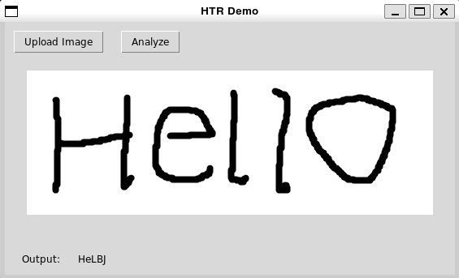
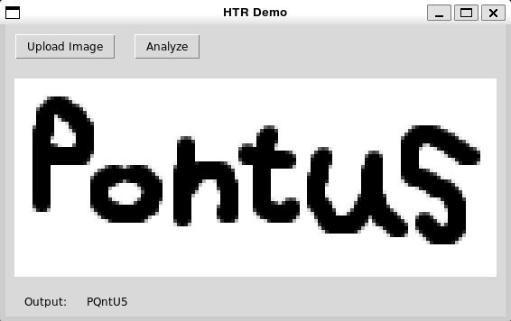

# AIwPy-final
Final assignment for AI dev with Python

---
## Handwritten Text Recognition (HTR) Demo

Included here is training script and interface-application for 
a locally trained and executed HTR model.

### Training

### Execution

Input image is segmented into individual characters and preprocessed 
to resemble training data using opencv4. Later the images are normalized to an 
array of float32 before being fed to the model. 
Predictions are made of every image and the one with highest confidence of each image 
is concatenated and displayed.

#### Examples

Input image and result:

Opencv4-processed images:

    

Input image and result:

Opencv4-processed images:

     

### Reflections

The model isn't prefect but for a demonstration of HTR capabilities, it is good enough. 
The model isn't entirely at fault for failed predictions either. Part of the blame 
lies with the preprocessing done with opencv4, as it tends to accentuate features of othrewise 
featureless characters. 
*see the 2 'l's in "Hello"*

---

#### Training data

[EMNIST-balanced](https://www.nist.gov/itl/products-and-services/emnist-dataset): Cohen, G., Afshar, S., Tapson, J., & van Schaik, A. (2017). EMNIST: an extension 
of MNIST to handwritten letters. Retrieved from http://arxiv.org/abs/1702.05373
